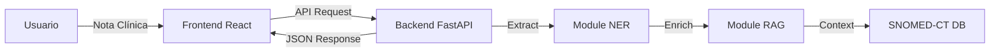

# Proyecto RAG Ontología

Bienvenido al repositorio oficial del proyecto **RAG Ontología**. Este proyecto representa un esfuerzo de vanguardia en el desarrollo e implementación de soluciones basadas en **Generación Aumentada por Recuperación (RAG)** aplicadas a dominios ontológicos complejos, desarrollado en el **Hospital Clínic de Barcelona**.

El proyecto aborda la extracción precisa de información clínica y su enriquecimiento mediante ontologías médicas estándar como **SNOMED-CT**.

---

## 📋 Tabla de Contenidos

1.  [Visión General](#visión-general)
2.  [Arquitectura del Sistema](#arquitectura-del-sistema)
    *   [Solución 1: Pipeline NER + RAG (`ofarres`)](#solución-1-pipeline-ner--rag-ofarres)
    *   [Solución 2: Ensemble Híbrido Estricto (`new_ofarres`)](#solución-2-ensemble-híbrido-estricto-new_ofarres)
3.  [Guía de Ejecución](#guía-de-ejecución)
    *   [Ejecutar Frontend y API (`ofarres`)](#ejecutar-frontend-y-api-ofarres)
    *   [Generar Visualizaciones (`new_ofarres`)](#generar-visualizaciones-new_ofarres)
4.  [Estructura del Proyecto](#estructura-del-proyecto)
5.  [Autores y Licencia](#autores-y-licencia)

---

## 🏥 Visión General

El objetivo principal es mejorar la interpretabilidad y precisión de los sistemas de IA en entornos clínicos. Utilizamos ontologías estructuradas para validar y enriquecer las entidades extraídas de notas clínicas no estructuradas (ej. informes de radiología).

El repositorio está dividido en dos fases evolutivas:
*   **`ofarres/`**: La primera iteración, centrada en un pipeline RAG completo con interfaz web.
*   **`new_ofarres/`**: La iteración actual, centrada en un **Ensemble Híbrido** de alta precisión y visualización de grafos de conocimiento.

---

## 🏗️ Arquitectura del Sistema

### Solución 1: Pipeline NER + RAG (`ofarres`)

Esta solución implementa un flujo completo desde la extracción hasta la visualización web.

#### Componentes Principales:
1.  **Backend (FastAPI)**:
    *   **NER Pipeline (Stage 1)**: Utiliza **spaCy**, **scispaCy** (SciBERT) y coincidencia exacta de ontologías para extraer entidades.
    *   **RAG Module (Stage 2)**: Enriquece las entidades mediante búsqueda vectorial (**FAISS** + **SapBERT**) sobre SNOMED-CT.
2.  **Frontend (React + Vite)**:
    *   Interfaz moderna para visualizar notas clínicas.
    *   Resaltado interactivo de entidades y exploración de la ontología.

#### Diagrama de Flujo:


---

### Solución 2: Ensemble Híbrido Estricto (`new_ofarres`)

Esta solución refina la precisión mediante un enfoque de "Voto Mayoritario Estricto" y visualización avanzada de jerarquías.

#### Componentes Principales:
1.  **Ensemble NER (`src/NER/ensamble.py`)**:
    *   Combina dos extractores potentes:
        *   **DFA Extractor**: Autómata Finito Determinista para coincidencias léxicas exactas y rápidas.
        *   **LLM Extractor**: Modelos de lenguaje grandes para comprensión contextual.
    *   **Lógica de "Maximal Munch"**: Resuelve conflictos de superposición priorizando tramos más largos y coincidencias de ontología verificadas.
    *   **Filtrado Estricto**: Solo sobreviven las entidades que pueden mapearse a un código SNOMED válido.

2.  **Tree Builder & Visualizer (`src/Ontology/tree_builder.py`)**:
    *   Construye árboles jerárquicos basados en las relaciones `IS-A` de la ontología OWL.
    *   Genera un grafo interactivo en HTML utilizando **D3.js**.

---

## 🚀 Guía de Ejecución

Asegúrese de haber completado los pasos previos en [SETUP.md](SETUP.md).

### Ejecutar Frontend y API (`ofarres`)

Para interactuar con la interfaz web de la primera solución:

#### 1. Iniciar el Frontend (React)
Navegue al directorio del frontend e inicie el servidor de desarrollo:

```bash
cd ofarres/frontend
npm install   # Solo la primera vez
npm run dev
```
> El frontend estará disponible en: `http://localhost:5173` (o el puerto que indique Vite).

#### 2. Iniciar el Backend (FastAPI)
(Opcional, si desea que el frontend procese datos reales)

```bash
cd ofarres
uvicorn api.main:app --reload
```

---

### Generar Visualizaciones (`new_ofarres`)

Para ejecutar el nuevo pipeline de ensemble y generar el Grafo de Conocimiento interactivo:

#### 1. Ejecutar el Constructor de Árboles
Este script procesará las notas, aplicará la ontología y generará el HTML.

```bash
# Desde la raíz del proyecto
python new_ofarres/src/Ontology/tree_builder.py
```

#### 2. Visualizar el Resultado
El script generará un archivo HTML en:
`data/processed/knowledge_graph.html`

Abra este archivo en su navegador web favorito (Chrome, Firefox, Edge) para ver el grafo interactivo.
*   **Vista Árbol**: Muestra la jerarquía textual.
*   **Vista Grafo**: Muestra una visualización de nodos y enlaces con D3.js.

---

## 📂 Estructura del Proyecto

```
RAG_ontologia/
├── ofarres/                      # SOLUCIÓN 1 (Frontend + Backend)
│   ├── api/                      # Endpoints FastAPI
│   ├── backend/                  # Lógica Core (NER, RAG)
│   ├── frontend/                 # Aplicación React/Vite
│   └── ARCHITECTURE.md           # Documentación técnica específica
├── new_ofarres/                  # SOLUCIÓN 2 (Ensemble + Grafos)
│   ├── src/
│   │   ├── NER/                  # Scripts de Ensemble (DFA + LLM)
│   │   └── Ontology/             # Scripts de Ontología y Visualización
│   └── LLM_evaluation/           # Benchmarks de modelos
├── data/                         # Datos compartidos (Notas, JSONs)
├── snomed-ct-entity-linking/     # Submódulo de utilidades SNOMED
├── README.md                     # Documentación Principal
└── SETUP.md                      # Guía de Instalación
```

---

## 👥 Autores y Licencia

**Departamento de Informática Clínica - Hospital Clínic de Barcelona**

*   **Autor Principal:** Oriol Farrés
*   **Supervisión:** Santiago Frid y Ramsés Marrero

Consulte [LICENSE.md](LICENSE.md) para detalles legales.
